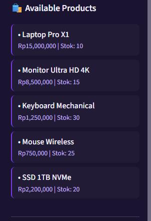

# 🛒 Virtual Sales Agent

**Asisten Penjualan Virtual berbasis AI dengan LangChain, LangGraph & LangSmith**


---

## 📋 Daftar Isi

- [Fitur Utama](#fitur-utama)
- [Screenshot Aplikasi](#screenshot-aplikasi)
- [Teknologi yang Digunakan](#teknologi-yang-digunakan)
- [Dokumentasi Penerapan LangChain, LangGraph & LangSmith](#dokumentasi-penerapan-langchain-langgraph-langsmith)
- [Diagram Alur Sistem](#diagram-alur-sistem)
- [Cara Menjalankan](#cara-menjalankan)
- [Struktur Folder](#struktur-folder)
- [Author](#author)
- [License](#license)

---

## 📋 Fitur Utama

| No | Fitur | Perintah Contoh |
|----|-------|-----------------|
| 1 | **Dashboard Awal** | Menampilkan halaman utama aplikasi |
| 2 | **Tampilkan Produk** | `tampilkan produk` |
| 3 | **Filter Produk** | `ada laptop apa saja?` |
| 4 | **Cek Stok Produk** | `cek stok Laptop Pro X1` |
| 5 | **Spesifikasi Produk** | `spesifikasi Laptop Pro X1` |
| 6 | **Buat Order** | `saya mau beli Laptop Pro X1 2 unit` |
| 7 | **Approve Order** | `approve` |
| 8 | **Cek Status Order** | `cek status order #7` |
| 9 | **Rekomendasi Produk** | `rekomendasi produk` |
| 10 | **Detail Proses** | Menampilkan Intent & Order Data |

---

## 📸 Screenshot Aplikasi

### 1. Dashboard Awal


### 2. Folder Project


### 3. Folder Src


### 4. Produk yang Tersedia


### 5. Filter Produk Berdasarkan Kategori


### 6. Spesifikasi Produk


### 7. Order - Menunggu Persetujuan


### 8. Approve Order


### 9. Cek Status Order


### 10. Teknologi yang Digunakan


### 11. Tracking Eksekusi AI


### 12. API Key LangSmith


### 13. Diagram Alur Sistem


---

## 🛠️ Teknologi yang Digunakan


| No | Teknologi | Versi | Kegunaan |
|----|-----------|-------|----------|
| 1 | **Python** | 3.13 | Bahasa pemrograman utama |
| 2 | **LangChain** | 1.x | Framework aplikasi LLM |
| 3 | **LangGraph** | 1.x | Stateful workflow |
| 4 | **LangSmith** | 1.x | Tracing & Monitoring |
| 5 | **Streamlit** | 1.38.0 | UI Framework |
| 6 | **Ollama** | - | Local LLM (llama3.2:1b) |
| 7 | **SQLite** | 3.x | Database |

---

## 📚 Dokumentasi Penerapan LangChain, LangGraph & LangSmith

### 1. LangChain

**Pengertian:**
LangChain adalah framework open-source yang dirancang untuk mempermudah pembuatan aplikasi berbasis Large Language Model (LLM).

**Penerapan di Project:**

| Komponen | Fungsi | Implementasi |
|----------|--------|--------------|
| **Prompts** | Template instruksi ke LLM | `PromptTemplate`, `ChatPromptTemplate` di `sales_agent.py` |
| **LLMs** | Interface ke model bahasa | `ChatOpenAI` dengan base_url ke Ollama |
| **Chains** | Rangkaian operasi berurutan | `prompt \| llm \| StrOutputParser()` |
| **Tools** | Fungsi yang dipanggil agent | `@tool` decorator di `tools.py` |
| **Output Parsing** | Memproses output LLM | `StrOutputParser` |
```
**Kode Contoh:**
```python
from langchain_core.prompts import ChatPromptTemplate
from langchain_core.output_parsers import StrOutputParser
from langchain_openai import ChatOpenAI

# Prompt Template
prompt = ChatPromptTemplate.from_messages([
    ("system", f"Anda adalah {self.config.SALESPERSON_NAME}..."),
    ("human", user_input)
])

# Chain dengan LCEL
chain = prompt | self.llm | StrOutputParser()

# Eksekusi
response = chain.invoke({})
```
###2. LangGraph
Pengertian:
LangGraph adalah framework untuk membangun workflow AI yang stateful dan kompleks menggunakan konsep graph.

Penerapan di Project:

| Komponen    | Fungsi                         | Implementasi                                 |
| ----------- | ------------------------------ | -------------------------------------------- |
| State       | Data yang dibagikan antar node | `SalesState` (`query`, `intent`, `response`) |
| Nodes       | Fungsi pemroses state          | `classify_intent`, `_process`                |
| Edges       | Penghubung antar node          | `add_conditional_edges`                      |
| MemorySaver | Menyimpan state antar sesi     | `MemorySaver()`                              |
```
```Alur Graph:
User Input → classify_intent → routing → 
  product → product_inquiry → general_response
  order → general_response (dengan pending approval)
  track → order_tracking → END
  recommend → recommendation → END
  approve/reject → general_response → END
  general → general_response → END
```
Kode Contoh:
```from langgraph.graph import StateGraph, END
from langgraph.checkpoint.memory import MemorySaver

# Definisi State
class SalesState(TypedDict):
    current_query: str
    intent: str
    response: str
    order_data: dict
    needs_approval: bool

# Membuat Graph
workflow = StateGraph(SalesState)

# Menambahkan Nodes
workflow.add_node("classify_intent", self._classify_intent)
workflow.add_node("general_response", self._general_response)

# Conditional Routing
workflow.add_conditional_edges(
    "classify_intent",
    self._route_by_intent,
    {
        "product": "product_inquiry",
        "order": "general_response",
        "track": "order_tracking",
        "general": "general_response"
    }
)

# Compile dengan MemorySaver
self.workflow = workflow.compile(checkpointer=MemorySaver())
```
### 3. LangSmith
Pengertian:
LangSmith adalah platform untuk debugging, evaluasi, dan monitoring aplikasi LLM.

Penerapan di Project:
| Fitur              | Fungsi                          | Implementasi                            |
| ------------------ | ------------------------------- | --------------------------------------- |
| Tracing            | Merekam setiap langkah eksekusi | `@traceable` decorator                  |
| Project Management | Mengelompokkan trace            | `LANGSMITH_PROJECT=sales-agent-project` |
| Monitoring         | Dashboard real-time             | LangSmith dashboard                     |
```
```Konfigurasi .env:
LANGSMITH_API_KEY=lsv2_pt_xxxxxxxxxx
LANGSMITH_TRACING_V2=true
LANGSMITH_PROJECT=sales-agent-project
```
Kode Contoh:
```from langsmith import Client, traceable

@traceable(name="process_with_tools", project_name="sales-agent-project")
def process_with_tools(self, user_input: str) -> str:
    # Fungsi ini akan otomatis di-trace
    return self._process(user_input)
```
```Tracking Eksekusi AI:
https://gambar/tracking%2520eksekusi%2520AI.png
```

### 4. Integrasi Ketiga Library
### 4. Integrasi Ketiga Library
```
| Library | Peran | Fungsi Utama |
|---------|------|--------------|
| **LangChain** | Plan (Perencanaan) | Prompts, LLMs, Chains, Tools |
| **LangGraph** | Execute (Eksekusi) | State, Nodes, Edges, MemorySaver |
| **LangSmith** | Observe (Observasi) | Tracing, Evaluasi, Monitoring |

**Siklus Plan - Execute - Observe:**

Plan (LangChain) → Execute (LangGraph) → Observe (LangSmith)
```
| Library   | Peran                  | Fungsi                               |
| --------- | ---------------------- | ------------------------------------ |
| LangChain | Foundation (Plan)      | Komponen dasar: prompt, model, tools |
| LangGraph | Orchestrator (Execute) | Alur kerja dan state management      |
| LangSmith | Observer (Observe)     | Tracing, evaluasi, monitoring        |
```
```📊 Diagram Alur Sistem
gambar/alur%20sistem.png
```
```Alur Proses:
User Input → Streamlit UI → Graph Workflow → classify_intent → 
Intent Routing → Node Processing → Sales Agent → 
Tools / LLM / Database → Response → User
```
```Alur Order & Approval:
User: "saya mau beli produk X" → Buat Order → pending_approval → 
User: "approve" → Update Status: approved → Response: "Pesanan berhasil"
```
```🚀 Cara Menjalankan
Prasyarat
| No | Software     | Keterangan         |
| -- | ------------ | ------------------ |
| 1  | Python 3.10+ | Bahasa pemrograman |
| 2  | Ollama       | Local LLM          |
| 3  | Git          | Version control    |
```
```Langkah-langkah
# 1. Clone repository
git clone https://github.com/username/sales-agent-project.git
cd sales-agent-project

# 2. Buat virtual environment
python -m venv venv

# 3. Aktifkan venv (Windows)
venv\Scripts\activate

# 4. Install dependencies
pip install -r requirements.txt

# 5. Setup database
python setup_database.py

# 6. Jalankan Ollama
ollama serve

# 7. Jalankan aplikasi
streamlit run streamlit_app.py
```
```📁 Struktur Folder
SALES-AGENT-PROJECT/
│
├── .streamlit/                            # Konfigurasi Streamlit
│   └── config.toml                        # Tema UI
│
├── database/                              # Database
│   └── sales.db                           # SQLite
│
├── gambar/                                # Screenshot & Diagram
│   ├── alur sistem.png
│   ├── API key lang smith.png
│   ├── approve produk.png
│   ├── cek order produk.png
│   ├── Dashboard awal.png
│   ├── filter produk.png
│   ├── folder sales_agent_project.png
│   ├── folder sales_agent.png
│   ├── order produk.png
│   ├── produk.png
│   ├── spesifikasi dari produk.png
│   ├── teknologi yang di gunakan.png
│   └── tracking eksekusi AI.png
│
├── src/                                   # Source Code
│   ├── __init__.py                        # Python package
│   ├── config.py                          # Konfigurasi
│   ├── database.py                        # Operasi database
│   ├── evaluator.py                       # Evaluasi (opsional)
│   ├── graph_workflow.py                  # LangGraph workflow
│   ├── sales_agent.py                     # Core sales agent
│   └── tools.py                           # Tools untuk agent
│
├── venv/                                  # Virtual environment
├── .env                                   # Environment variables ⚠️
├── .gitignore                             # Git ignore
├── example.env                            # Template .env
├── README.md                              # Dokumentasi
├── requirements.txt                       # Dependencies
├── setup_database.py                      # Setup database
└── streamlit_app.py                       # UI utama
```
```👨‍💻 Author
| Identitas   | Keterangan                            |
| ----------- | ------------------------------------- |
| Nama        | Muhammad Aidhil                       |
| NPM         | 233510373                             |
| Kelas       | NLP (Natural Language Processing - C) |
| Universitas | Universitas Islam Riau                |
| Email       | [Email]                               |
```
```📄 License
MIT License

Copyright (c) 2026 Muhammad Aidhil

Permission is hereby granted, free of charge, to any person obtaining a copy
of this software and associated documentation files (the "Software"), to deal
in the Software without restriction, including without limitation the rights
to use, copy, modify, merge, publish, distribute, sublicense, and/or sell
copies of the Software, and to permit persons to whom the Software is
furnished to do so, subject to the following conditions:

The above copyright notice and this permission notice shall be included in all
copies or substantial portions of the Software.

THE SOFTWARE IS PROVIDED "AS IS", WITHOUT WARRANTY OF ANY KIND, EXPRESS OR
IMPLIED, INCLUDING BUT NOT LIMITED TO THE WARRANTIES OF MERCHANTABILITY,
FITNESS FOR A PARTICULAR PURPOSE AND NONINFRINGEMENT. IN NO EVENT SHALL THE
AUTHORS OR COPYRIGHT HOLDERS BE LIABLE FOR ANY CLAIM, DAMAGES OR OTHER
LIABILITY, WHETHER IN AN ACTION OF CONTRACT, TORT OR OTHERWISE, ARISING FROM,
OUT OF OR IN CONNECTION WITH THE SOFTWARE OR THE USE OR OTHER DEALINGS IN THE
SOFTWARE.
```
📋 ALUR LENGKAP
STEP 1: Clone Repository
```
git clone https://github.com/username/sales-agent-project.git
cd sales-agent-project
```
STEP 2: Buat Virtual Environment
```
# Windows
python -m venv venv

# Mac/Linux
python3 -m venv venv
```
STEP 3: Aktivasi Virtual Environment
```
# Windows (Command Prompt)
venv\Scripts\activate

# Windows (PowerShell)
venv\Scripts\Activate.ps1

# Mac/Linux
source venv/bin/activate
```
STEP 4: Install Dependencies
```
pip install -r requirements.txt
```
STEP 5: Setup Database
```
python setup_database.py
```
STEP 6: Jalankan Ollama
```
ollama serve
```
STEP 7: Jalankan Aplikasi Streamlit
```
streamlit run streamlit_app.py
```
STEP 8: Buka Browser
```
http://localhost:8501
```
```📚 Referensi
LangChain Documentation

LangGraph Documentation

LangSmith Documentation

Ollama

Streamlit

Terima kasih telah mengunjungi repository ini! 🚀😊
```